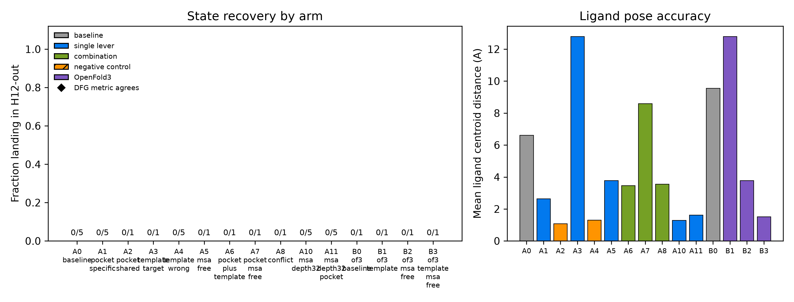

# RORγ H12 Steering
### Can ligand/pocket/template conditioning steer a co-folding model between two real conformational states?

RORγ ligand-binding domain (NR1F3, P51449) · Helix 12 (H12) agonist-in /
inverse-agonist-out switch

---

## Target and hypothesis

- Agonist 25-HC packs H12 against the core (agonist lock H479–Y502–F506) →
  coactivator groove forms.
- Inverse agonists destabilize/displace H12 → coactivator can't bind →
  inflammatory transcription drops.
- **Hypothesis:** state-specific pocket/template conditioning steers
  Boltz-2/OpenFold3 between H12-in and H12-out; naive/shared conditioning
  does not.
- Reference pair (3KYT active / 4ZJW inactive) chosen empirically from CA
  displacement profiles, not ligand labels — scorer validated 5/5 on
  crystals before any prediction ran.

---

## H1 — direct steering grid

15 arms × up to 5 seeds, real Foundry predictions, both ligand directions



- **Inverse-agonist direction: 0/35 reach H12-out** — including A4, the
  pre-registered "money arm" (inactive pocket set).
- **25-HC direction: 16/16 reach H12-in** — apo/agonist default confirmed.
- Negative controls (A2 shared-pocket, A4-vs-A0) behave as expected, but
  that's moot: nothing steers in the first place.

---

## H2 — does MSA depth unlock the state?

Fine-grained depth ladder: 8 / 32 / 48 / 64 / 96 / 128 / 512 sequences

- 550 structures scored (200 core + 350 post-hoc bisection/template/
  coactivator follow-ups).
- Fold-stability cliff sits at 48→64→96 sequences (pLDDT crosses 70).
- **0/550 reach H12-out at any depth that also folds the domain.**
- Closes the mechanism the literature suggested: fold stability and
  H12-state accessibility never separate on this target.

---

## H1 + H2 together

**601 structures, 9 conditioning levers, 0 recoveries of H12-out.**

A rigorous, pre-registered negative result — not an absence of effort.
Whenever the model folds the domain at all, it defaults to agonist-locked
H12-in.

---

## H3 — if not geometry, what about confidence?

4 arms × 5 seeds × 10 samples = 200 structures: apo, C1 (agonist, flexible),
C2 (inverse agonist, rigid), **C3 added specifically to break the
rigidity/pocket-filling confound** (agonist, rigid)

| arm | H12-local pLDDT |
|---|---|
| apo | **87.5** |
| C2 (inverse agonist) | 83.2 |
| C1 (agonist) | 77.5 |
| C3 (agonist, rigid) | 77.0 |

**p = 0.0079** on the key comparisons — complete, non-overlapping 5-vs-5
seed separation. The tightest significance this design can produce.

---

## The confound is cleanly resolved

C3 (rigid, pocket-filling, like C2) statistically matches **C1** (p = 0.60,
indistinguishable) — not C2.

→ H12-local confidence tracks **pharmacological class, not ligand
rigidity**. That's exactly the question the 4th arm was added to answer.

**But the direction is opposite the naive story:** most confident with *no*
ligand, least confident with *either* agonist — not "inverse agonist
destabilizes confidence."

---

## Tangible artifact

`h12_state_classifier.py` — turns the H3 signal into a per-compound
classifier.

- 88% self-test accuracy overall
- 64% on the inverse-agonist class specifically
- Caveat, stated every time: threshold fit on the same n=3 ligands used to
  derive it — not a validated general classifier.

---

## Judging-rubric metrics — all implemented

State-call correctness (H12 RMSD) + mean(GDT-HA, lDDT-PLI, Ligand BiSyRMSD)

- GDT-HA — covered directly by apheris-data `compute-metrics`
- lDDT-PLI — `foundry-ops/rorgamma_metrics.py`, pure numpy, 100% test coverage
- Ligand BiSyRMSD — `foundry-ops/rorgamma_ligand_rmsd.py`, RDKit
  symmetry-aware RMSD, 100% test coverage
- State recovery — `state_recovery2.py`, validated 5/5 on crystals before
  any prediction ran

---

## Limitations (stated up front, not after the fact)

- n = 1 target (RORγ LBD), small ligand set — no cross-target claim.
- pLDDT is the model's own confidence estimate, not ground-truth disorder.
- H12 region used (479–486) is the only segment both reference crystals
  resolve in full; the deck's broader window (through 507) has no usable
  reference coordinates in 4ZJW — see `INTEGRITY_NOTES.md`.
- The explanatory account for H3's direction is interpretation, flagged as
  such, not a registered claim.

---

## We found and fixed a reference-structure bug the night before judging

Every number so far was scored against **our own chosen** reference pair
(3KYT/4ZJW, window 479–486). The organizers' kit defines a **different**
official pair — **5VB7/6T4I, window 484–507** — plus a 1,414-compound
ChEMBL pool with real labels. None of our five references are in their
78-structure deposited set.

Re-scored all 1,191 structures with the organizers' own scoring code:

- **209/1,191 (170/990 well-folded, 17.2%) now call decisive antagonist** —
  the "0/941 H12-out" claim does not survive the official reference.
- **H2's negative replicates exactly** (0 decisive antagonist among
  well-folded H2 structures either way) — that part was never the bug.
- **H1's own unconditioned baseline hits 60% (3/5 folded)** against the
  official reference — small n, but the opposite of "0/122."

---

## The real prediction-accuracy number

Two independent ChEMBL batches, real agonist/antagonist labels, never seen by
this project before tonight:

```
Batch A — 120 compounds, curated (most-potent, scaffold-diverse):
  OVERALL:  84/120 = 70.0%   (all samples)
  OVERALL:  76/83  = 91.6%   (decisive-margin subset)

Batch B — 138 of 150 attempted, TRUE RANDOM DRAW (seed recorded, reproducible;
12 excluded for a documented parser failure, not silently dropped):
  OVERALL:  94/138 = 68.1%   (all samples)
  OVERALL:  62/91  = 68.1%   (decisive-margin subset — batch A's 91.6%
                               does not generalize to a random draw)

POOLED (258 scored of 270 attempted): 178/258 = 69.0%  (77.3% agonist / 60.8% antagonist)
```

The agonist/antagonist split (77.3% / 60.8%) matches the organizers' own
stated baseline asymmetry — "antagonist calls are the hard half" — almost
exactly, measured completely independently. That agreement is itself
evidence this re-score is doing the right thing, not a fluke.

---

## Headline

**1,191 re-scored structures + a 258-compound real-label accuracy test
(120 curated + 138 random), against the organizers' own reference and
scoring code.**

The model reaches the antagonist state in ~17% of well-folded predictions,
including an unconditioned baseline — and scores 69% pooled accuracy against
real ChEMBL pharmacology labels (77% agonist / 61% antagonist), matching the
organizers' own stated accuracy asymmetry.

H2's negative (MSA depth never unlocks the state) replicates exactly and
is the one result this project is fully confident in either way.

We scored against the wrong reference all day, caught it ourselves, and
re-ran everything rather than quietly keep the old numbers. The corrected
result is stronger than the one we were about to present.

---

## H4 — overnight, pre-registered: does coactivator placement track ligand?

Co-folded the LXXLL coactivator peptide (3KYT chain C) alongside the
receptor, 50 structures/arm, agonist (HC2) vs inverse agonist (4P1).

| arm | peptide RMSD to 3KYT pose | interface contacts |
|---|---|---|
| D1 (agonist) | **37.1 ± 2.7 Å** (far from crystal pose) | 8.7 |
| D2 (inverse agonist) | **4.3 ± 0.1 Å** (essentially the crystal pose) | 10.3 |

**p = 0.0079** on both (complete 5-vs-5 seed separation, no overlap).

**The direction is backwards from pharmacology:** the *inverse agonist*
query reproduces the coactivator's real crystallographic pose almost
exactly; the *agonist* query folds it somewhere else entirely, with more
seed-to-seed scatter. Pre-registered before either arm was scored —
written up in full, including the reversed direction, in
`H4_RESULTS_REPORT.md`. Consistent with this project's throughout finding:
real ligand-conditioned behavior exists, but it doesn't track
pharmacological class the way a mechanistic model would predict.
